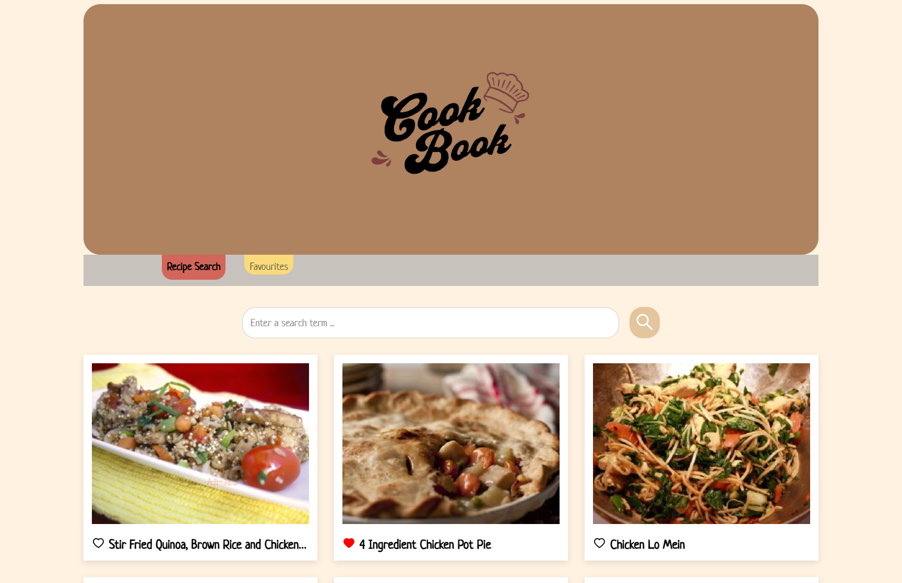
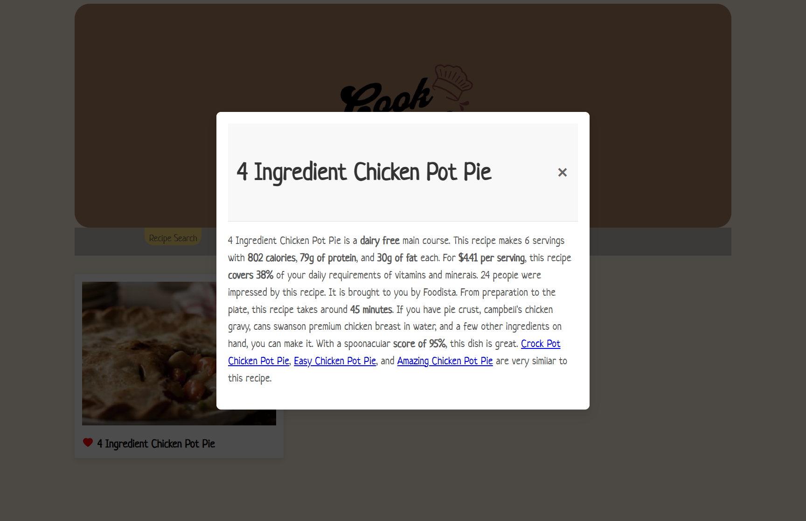

# 📖 CookBook

CookBook is a web application that helps users discover and manage food recipes.
You can search for recipes and save your favorite dishes in one place.

The recipe data is powered by the Spoonacular API.

This project is originally based on a template by **Chris Blakely** and has been redesigned, customized, and extended further including Docker integration and deployment setup.

## ❤️ Live Demo

[https://speech-to-text-zeta-inky.vercel.app](https://cook-book-three-navy.vercel.app/)

## 🚀 Features
* Search for recipes 🔍
* Save recipes to favorites ❤️
* 🌐 Fetch recipe data from Spoonacular API
* 🐳 Docker support (custom integration)

## 🛠 Tech Stack

**Frontend**
* React
* Vite

**Backend**
* Node.js
* Express

**Database**
* Supabase (PostgreSQL)

**ORM**
* Prisma

**Deployment**

* Frontend: Vercel
* Backend: Render

## 🚀 Installation

### 1. Clone the repository

```bash
git clone https://github.com/93bazmi/CookBook.git
cd CookBook
```

### 2. Backend Setup

Create a .env file inside the backend folder:
```bash
DATABASE_URL=your_supabase_database_url
API_KEY=your_spoonacular_api_key
```

Navigate to backend:
```bash
cd backend
npm install
```

Setup Prisma:
```bash
npx prisma init
npx prisma generate
```

Run backend:
```bash
npm run dev
```
### 3. Frontend Setup

Navigate to frontend:
```bash
cd frontend
npm install
npm run dev
```
## 📸 Screenshots




## 🙏 Credits
* Template: https://github.com/chrisblakely01/react-node-recipe-app.git
* Original author: Chris Blakely
* This project has been modified, redesigned, and extended further.


